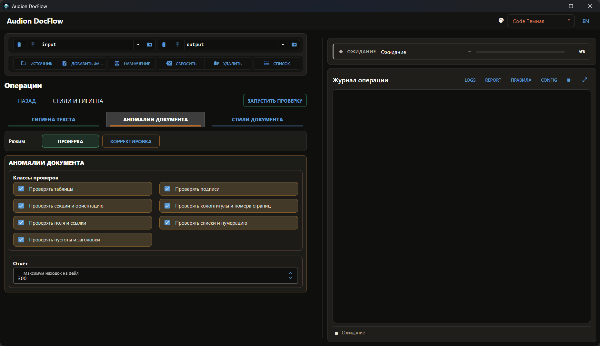

# Audion DocFlow (Portable)

<!-- audion:release -->
<p align="center">
  <a href="https://audion.dev/downloads/docflow"></a>
  <a href="https://github.com/Tensionix/docflow/releases/latest"></a>
  <a href="https://github.com/Tensionix/docflow/releases"></a>
  <a href="https://github.com/Tensionix/docflow/blob/main/LICENSE"></a>
</p>

**Version 2.0.1** · 2026-08-25 · 211.8 MB

- [Direct download](https://audion.dev/get/docflow/2.0.1/Audion_DocFlow_v2.0.1_Full.zip) — unmetered, no rate limits
- [Project page](https://audion.dev/downloads/docflow) — every version and how to install

<p align="center"></p>

`SHA-256: 76430b3b9e2404f0fa6704ef167e766babf13d364da071fa3417f4aa5d70bc97`

---

An **Audion** tool, published by [Tensionix](https://github.com/Tensionix).
<!-- /audion:release -->

A portable, offline-friendly toolkit for deterministic document cleanup, compliance gating, and table helpers around **DOCX**, **XLSX**, **CSV**, and **Markdown**.

The project is designed for a stable portable workflow:
- user launchers stay in the project root;
- service/build tooling stays separate from the user menu;
- processed files go to `output\`;
- reports go to `report\`;
- launcher temp files stay inside `._runtime\`.

The current main-kit scope is **not OCR**. OCR experiments and AI-assisted OCR
flows should live in a separate dedicated project instead of being reintroduced
into this deterministic office-helper kit.

## What it does

### DOCX
- DOCX quality check for explicit non-black text, highlights, shading, strikethrough, comments, and tracked changes
- Strict DOCX check with non-zero exit code for automation pipelines
- One-click finalize + gate flow
- Strikethrough text removal during finalize cleanup without deleting paragraphs, tables, page breaks, or sections
- Strip comments
- Accept tracked changes in a safe best-effort mode
- Text hygiene scan/fix
- Text hygiene `--dry-run` for checking temporary Office-file cleanup and output writes without changing files
- Conservative DOCX nonprinting-garbage cleanup: only optional-hyphen artifacts (`U+00AD` and Word `w:softHyphen`) are removed; spaces, tabs, breaks, visible hyphens, and line-wrapping controls are preserved
- `Find and replace`: DOCX suspicious uppercase-after-comma reporting inside table cells only and optional comma-lowercase cleanup while preserving run formatting; reports include every hit with text after the simulated edit
- Russian morphological DOCX/XLSX find/replace via `pymorphy3`, with lemma matching, `Replace` and `Append next to match` modes, dry-run JSON reports, optional replacement/addition inflection, and full sentence-level replacement context
- dangerous `Find and replace` commands write hybrid reports: a summary file in
  `report\` plus per-document `.md/.json` files in a same-named report folder,
  with file names matching the source documents
- Style processing for headings, appendix titles, list structures, table/figure captions, TOC markers, sections, and conservative style assignment
- `DOCX anomaly inspector` in `Styles and hygiene`: a read-only anomaly report
  with human-oriented locations (`page / section / Table N / Figure N`). The
  implemented RO layer checks tables, table/figure captions,
  sections/orientation, headers/footers and page numbering, fields/TOC/links/
  bookmarks, lists/numbering, duplicated blanks, and dangling headings; the
  safe correction command writes copied DOCX files under
  `output\docx_anomaly_fixed` and can collapse duplicated blanks, remove exact
  table row heights, enable table-cell text wrapping, and optionally normalize
  table borders/cell margins
- `Deep DOCX hygiene` in `Styles and hygiene`: a two-pass aggregate run where
  text hygiene and deterministic audit rules run first, and document anomalies
  can be attached as the second pass. The unified
  `docx_deep_hygiene.md/.docx/.json` report records pass records,
  `domain_boundaries`, ownership boundaries, `target_index`,
  `unified_findings`, target/issue fingerprints, and suppressed exact
  duplicates. Morphology-backed address/toponym validation remains a future
  separate layer.
- Rules audit workflow for deterministic corporate rules such as `кв. м`, `куб. м`, `№ 1`, percent/degree spacing, date suffixes, table-caption typos, and scan-only `РФ`; it can write `*__annotated.docx` copies with visible audit anchors and later strip those anchors after approval
- Similar DOCX detection
- Exact hash duplicate groups inside the DOCX similarity report
- Two-DOCX diff without a threshold: by default matches sections by similarity, then compares body text and tables inside matched pairs; document-order comparison remains available; table of contents, media, and package internals are ignored
- Native two-DOCX comparison through Microsoft Word COM, producing a separate DOCX with Word revisions
- DOCX merge through Microsoft Word COM, close to manual document insertion
- Stitch sliced Word tables back together
- `Document tables unifyer`: one-pass normalization of all tables inside an
  existing DOCX without rebuilding document text; it infers the body font,
  uses two density-based table font sizes, normalizes borders and cell margins,
  skips the first two document pages by default, balances columns, and fits
  widths to document sections; the default cell margin is `0.2 cm`
- Unify compatible DOCX tables as table-only outputs or with heading/section
  rows preserved as merged rows; the Unifier preserves detected multi-row and
  merged headers more carefully, with pre-header rows, A4/A3, orientation, and
  millimeter margin controls
- Optimize DOCX table widths, adapt tables to page orientation, or fit existing
  tables to current document margins / explicit page setup without rebuilding
  the whole document; small-column tables can be excluded from fitting by a
  default threshold of 3 columns
- Extract all DOCX tables to XLSX with an index
- Extract all DOCX/PPTX media/images with an index
- Compact DOCX table-cell margins to `0.1 cm`; for XLSX the tool resets the
  available text indent because XLSX has no true Word-like cell-margin property

### XLSX, CSV, and Markdown
- XLSX value diff for two files
- Reconcile DOCX/XLSX/CSV tables into four lists
- Auto-detect a reconcile key column with `--auto-key`
- Export Markdown pipe tables to XLSX
- Remove insignificant Excel rows by creating XLSX copies without fully empty or whitespace-only rows

### GUI
- GUI shell via `launcher_gui.cmd` over the existing CLI/FZF commands
- canonical Workbench routing passes an external folder or one file as
  `Source` and the chosen result folder as `Target` directly to the backend,
  without staging a copy in local `input\`
- color themes in the GUI header; the selected theme lives in
  `config\gui_settings.yaml`, while palettes and CSS tokens live in
  `config\ui_colors.yaml`; the default is `Code Dark` (`code_dark`)
- a dedicated `Find and replace` section for comma-case cleanup and
  morphological replacement automation
- a dedicated `Rules audit` section for anchored audit, safe fixes, dry-run,
  and single-file or batch anchor removal; the `RULES` button opens
  `config\rules\`
- a dedicated `Styles and hygiene` workbench with `TEXT HYGIENE`, `DOCUMENT
  ANOMALIES`, and `DOCUMENT STYLES` tabs; scan/fix modes use distinct
  green/orange outlines, checkbox classes are laid out in a responsive grid,
  and the run button stays in the top command row beside Back
- a dedicated `WORD/EXCEL TABLES` section for DOCX table stitching after PDF
  export, dedicated repeated-header reconstruction, the root `Unify tables in
  document` command, safe and width-only unification, width optimization,
  orientation adaptation, table fitting, and table extraction
- control-free leaf commands run as compact dark-amber action buttons whose
  description stays separate; parameterized commands keep lighter rounded
  blocks with dark fields and checkbox/radio chips
- GUI tooltips are available on subsection names, commands, and parameter
  fields, so longer explanations do not need to stay visible in the panel
- XLSX value diff and table reconcile live in `Compare and reconcile`;
  Markdown table export and compact table-cell margins live in `Technical
  operations`
- service and release actions stay in `launcher_tools.cmd` / `builder_main.cmd`
  and are not shown on the first GUI screen

## Launchers

### User launchers
- `launcher_project.cmd` - English project launcher
- `launcher_project_ru.cmd` - Russian project launcher

Both launchers use the same internal logic, with:
- unified `FZF + CMD fallback` architecture;
- the first screen grouped by purpose: `Rules audit`, `Styles and hygiene`,
  `Find and replace`, `DOCX control and cleanup`, `Compare and reconcile`,
  `WORD/EXCEL TABLES`, `Technical operations`, and `Checks`;
- audit-rule operations kept separate from style/text-hygiene tools;
- separate temp files in `._runtime\`:
  - EN -> `project_menu_en.txt`, `project_menu_en_res.txt`
  - RU -> `project_menu_ru.txt`, `project_menu_ru_res.txt`

### Service layer
- `builder_main.cmd` - build/release launcher
- `launcher_tools.cmd` - service/tools launcher

The service layer now relies on:
- `install\init_folders.cmd`
- `install\make_release_archive.cmd`
- `system_core\license\`
- `licenses\`

## Recommended workflow

1. Put source files into `input\`.
2. Run `launcher_project.cmd` or `launcher_project_ru.cmd`.
3. Choose the needed tool.
4. Read processed files in `output\` and reports in `report\`.

For environment or release tasks:
- run `builder_main.cmd` for build/release operations;
- run `launcher_tools.cmd` for service and licensing tasks.

For the GUI:

```bat
launcher_gui.cmd
```

## Reports and UI language

- User-facing Markdown/DOCX reports are generated in Russian layout.
- In the `Find and replace` section, Markdown reports are for human review,
  while JSON reports are the machine contract for an external LLM pipeline.
  This project does not call an LLM; it only deterministically collects
  candidates, context, and simulated edit results.
- Scan/reporting tools support optional `--json-out PATH` for automation, with
  UTF-8 JSON and readable Russian strings.
- Technical statuses and identifiers (`OK`, `PASS`, `FAIL`, `diff`, `SHA-256`,
  `DOCX A/B`, Word style ids such as `a7`) are intentionally kept technical.
- Old files already present in `report\` are not rewritten automatically; rerun
  the related operation to regenerate a Russian report.

## Smoke Tests

Quick smoke:

```powershell
& '.\runtime\python.exe' '.\tests\smoke.py' --quick
```

Full smoke for the scripted tool set:

```powershell
& '.\runtime\python.exe' '.\tests\smoke.py' --full
```

## Project layout

- `launcher_project.cmd`, `launcher_project_ru.cmd` - user entry points
- `launcher_gui.cmd` - project GUI shell
- `builder_main.cmd`, `launcher_tools.cmd` - service/build entry points
- `input\` - source files
- `output\` - processed files
- `report\` - reports
- `logs\` - runtime and helper logs
- `install\` - portable environment and release scripts
- `system_core\` - Python tools and internal helpers
- `system_core\ui_nicegui\` - GUI shell from the portable template
- `system_core\services\` - GUI adapters around existing CLI commands
- `system_core\word_com\` - PowerShell/Word COM helper scripts
- `system_core\license\` - release licensing helpers
- `licenses\` - collected release notices
- `config\` - reserved project config area
- `config\tool_manifest.yaml` - GUI command tree
- `config\gui_settings.yaml` - GUI language, theme, and GUI-only settings
- `config\ui_colors.yaml` - GUI color theme palettes and CSS tokens
- `config\rules\rules.yaml` - machine-readable project audit rule map
- `config\rules\rules.md` - split between project-safe rules, residual AI proofreading, and the anchor workflow
- `runtime\` - embedded Python runtime
- `wheelhouse\` - offline wheels
- `release\` - packaged release output
- `GitHub\` - publication docs
- `._runtime\` - launcher temp files

## Notes

- Originals are not modified in place; outputs are written into `output\`.
- DOCX hygiene removes temporary Office `~$*` files inside the selected `input\`.
- All operations are local/offline.
- DOCX comparison through Word COM and DOCX merge through Word COM require
  installed Microsoft Word and available PowerShell
  (`system_core\powershell\pwsh.exe`, `pwsh.exe`, or Windows PowerShell).
- `system_core\powershell\` is reserved for the portable PowerShell runtime;
  project scripts should not be stored there.
- Complex tracked-change histories and unusual DOCX structures may still need a visual review in Word.

## Troubleshooting

If the runtime is missing, use:

```bat
builder_main.cmd
```

or:

```bat
install\Build_Portable_Env_Build.cmd
```

If launcher behavior looks wrong:
- first confirm the `.cmd` files are saved as `UTF-8 without BOM` and `CRLF`
  with `install\Check-CmdEncoding.cmd`;
- then inspect `._runtime\` for the launcher-specific temp files listed above.

## License

See the project license file if one is provided, and `licenses\THIRD_PARTY_NOTICES.md` in release-oriented builds.
## Canonical Workbench labels

Workbench uses the same Audion Image Tools public vocabulary in every project. Its buttons always keep the same order and labels: **Source**, **Add file...**, **Target**, **Reset**, **Delete**, **List**.

`Reset` returns to project `input/output` and does not delete files; `Delete` clears the current `Source` and `Target` only after confirmation. The exact Russian labels are **Источник**, **Добавить файл...**, **Назначение**, **Сбросить**, **Удалить**, **Список**. The Workbench variants `Destination`, `Clear`, `Цель`, and `Очистить` are not used.

## Document Integrity

DocFlow treats office files as structured packages rather than plain text. DOCX changes must preserve paragraphs, runs, styles, tables, relationships, media, fields, headers, footers, comments, and section properties unless the selected operation explicitly changes them. Spreadsheet work must preserve sheet identity, formulas, types, merged regions, and workbook relationships.

Every transformation writes a separate result and a report. Keep the source until the output opens in the target Office application and the relevant content has been checked. A text-level match is not sufficient for layout-sensitive or formula-sensitive documents.

## Controlled Automation

Use deterministic operations for exact replacements, normalization, hygiene, and known anomalies. Morphological or context-aware replacements require an explicit scope and a reviewable change list. Recursive folder runs should exclude output, runtime, work, and previously generated results to prevent a second pass over the same files.

When a file cannot be processed, keep it in the failure report rather than silently copying it into the successful set. The report should distinguish skipped, unchanged, changed, and failed documents.

## Acceptance

Open representative DOCX and XLSX/CSV outputs, compare counts and names, inspect tables and page structure, and review every warning. For a high-value batch, keep before/after hashes and the exact operation settings with the report.

The GUI manifest is also a documentation source. It defines the visible operation tree, input controls, defaults, tooltips, and command bindings. User-facing documentation should explain those controls in terms of document intent: what changes, what must remain intact, which output is produced, and how the operator can verify it. This keeps the guide aligned with the application without turning it into a raw field dump.

For presentations and release reviews, retain the workflow descriptions, integrity guarantees, supported formats, report model, and recovery notes. These sections explain why an operation exists and how it should be accepted; they are not disposable implementation detail.
